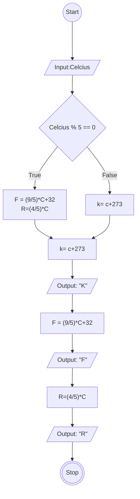

# Algoritma program konversi suhu

## Algoritma Deskriptif
1. Mulai
2. Masukan Celcius
3. Hitung konversi Celcius ke Fahrenheit 9/5 dikalikan dengan celcius ditambah 32
4. Hitung Konversi Celcius ke reamur 4/5 dikalikan dengan nilai Celcius
5. Hitung Konversi Celcius ke kelvin nilai celcius ditambah 273
6. Selesai

## Flowchart

