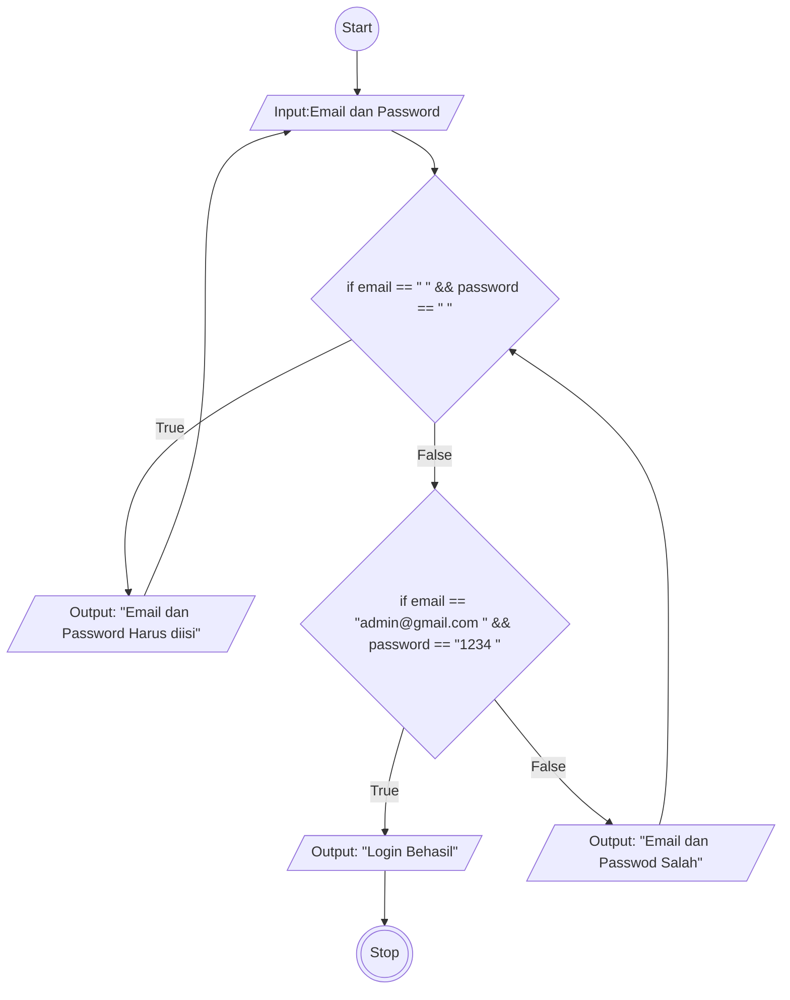

```mermaid
flowchart TD
A@{ shape: circle, label: "Start" }
B@{ shape: lean-r, label: "Input:Email dan Password" }
C@{ shape: diamond, label: 'if email == " " && password == " "'}
D@{ shape: lean-r, label: 'Output: "Email dan Password Harus diisi"' }
E@{ shape: diamond, label: 'if email == "admin@gmail.com " && password == "1234 "'}
F@{ shape: lean-r, label: 'Output: "Login Behasil"' }
G@{ shape: lean-r, label: 'Output: "Email dan Passwod Salah"' }
H@{ shape: dbl-circ, label: "Stop" }


A-->B-->C
C--True-->D-->B
C--False-->E
E--True-->F-->H
E--False-->G-->C


```