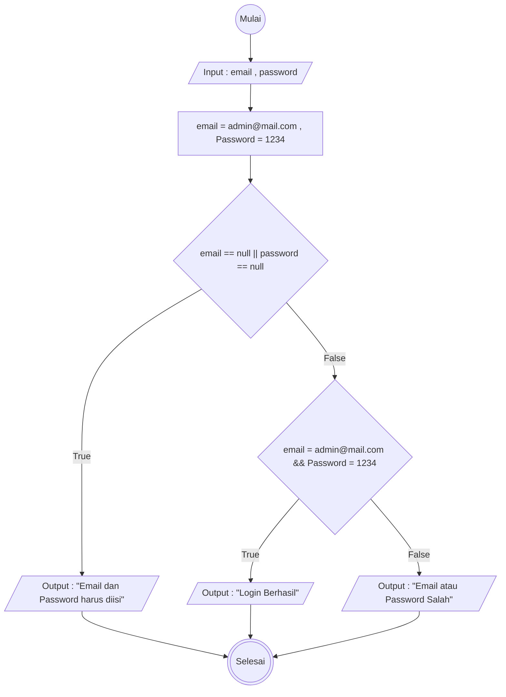

```mermaid
flowchart TD
    A@{ shape: circle, label: "Mulai" }
    B@{ shape: lean-r, label: "Input : email , password" }
    C@{ shape: rect, label: "email = admin@mail.com , Password = 1234" }
    D@{ shape: diamond, label: "email == null || password == null" }
    E@{ shape: lean-r, label: 'Output : "Email dan Password harus diisi"' }
    F@{ shape: diamond, label: "email = admin@mail.com && Password = 1234" }
    G@{ shape: lean-r, label: 'Output : "Login Berhasil"' }
    H@{ shape: lean-r, label: 'Output : "Email atau Password Salah"' }
    I@{ shape: dbl-circ, label: "Selesai" }


A --> B
B --> C
C --> D
D --True --> E
D --False --> F
F --True --> G
F --False --> H
E --> I
G --> I
H --> I


```