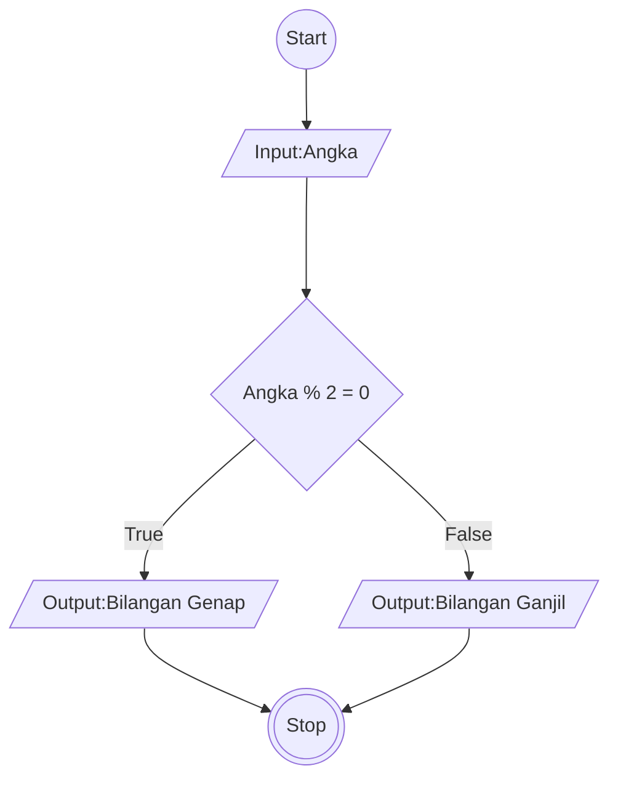

```mermaid
flowchart TD
    A@{ shape: circle, label: "Start" }
    B@{ shape: lean-r, label: "Input:Angka" }
    C@{ shape: diamond, label: "Angka % 2 = 0" }
    D@{ shape: lean-r, label: "Output:Bilangan Ganjil" }
    E@{ shape: lean-r, label: "Output:Bilangan Genap" }
    F@{ shape: dbl-circ, label: "Stop" }

    A --> B --->C
    C --True--> E
    C --False--> D
    E-->F
    D-->F

    
```