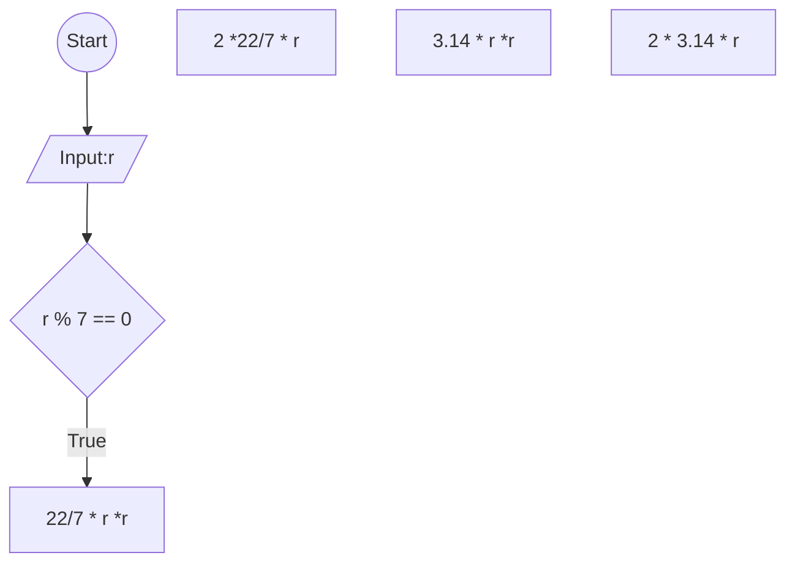

```mermaid

flowchart TD
A@{ shape: circle, label: "Start" }
B@{ shape: lean-r, label: "Input:r" }
C@{ shape: diamond, label: "r % 7 == 0" }
D@{ shape: rect, label: "22/7 * r *r" }
E@{ shape: rect, label: "2 *22/7 * r " }
F@{ shape: rect, label: "3.14 * r *r" }
G@{ shape: rect, label: "2 * 3.14 * r" }

A-->B-->C
C--True-->D


```