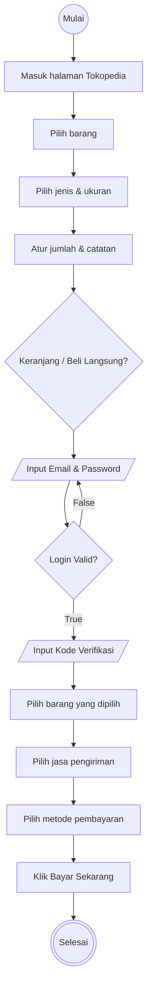

# Algoritma

## Analisis Proses Checkout Tokopedia

## Deskriptif

1. Mulai
2. masuk halaman tokopedia "https://www.tokopedia.com/"
3. Pilih barang yang diinginkan
4. Pilih jenis dan ukuran
5. Atur Jumlah dan catatan
6. silakan pilih masukan Keranjang atau Beli Langsung
7. Jika klik keranjang atau Beli Langsung maka sistem akan meminta user melakukan login
8. Masukan email dan password
9. Jika Username dan Password Benar maka user diminta untuk memasukan kode verivikasi yang dikirim melalui email
10. Masukan Kode verifikasi
11. Pilih barang yang sudahdipilih
12. Pilih Jasa Pengiriman
13. Pilih Metode Pembayaran 
14. klik bayar sekarang
15. Selesai

## Flowchart

